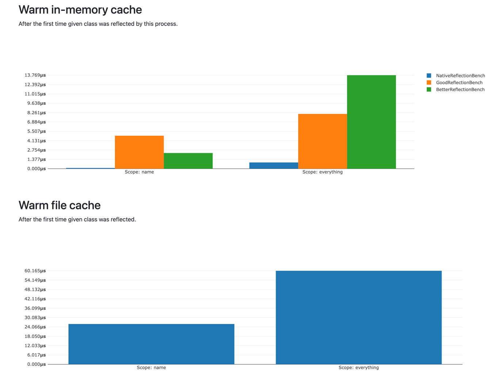
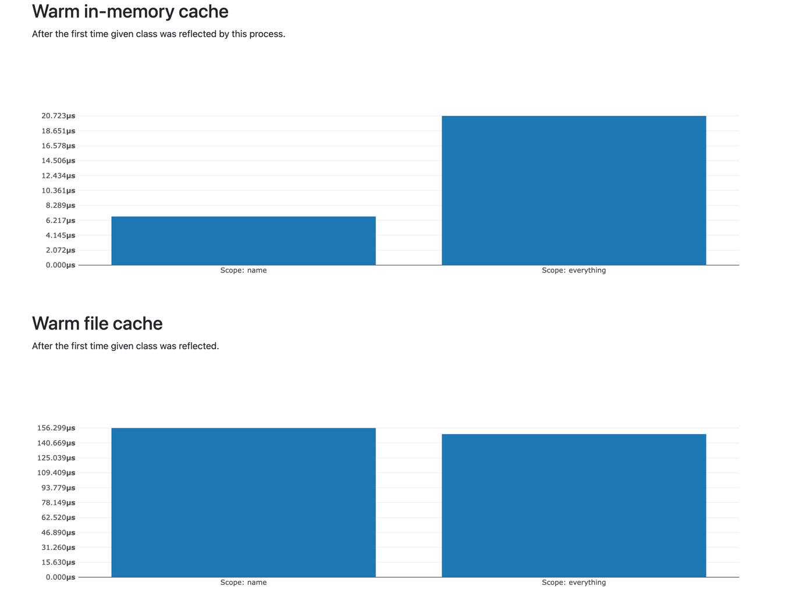

# Good PHP reflection

Reflection that accounts for features that are in static analysers, but aren't in the language yet.

```php
$reflector = new ReflectorBuilder()
	->withFileCache()
	->withMemoryCache()
	->build();

// Reflect a Collection class with generic types: Collection<int, \DateTime>
$reflection = $reflector->forType(\Illuminate\Support\Collection::class, [
	PrimitiveType::integer(), // TKey
	\DateTime::class, // TValue
]);

// array<int, \DateTime>
$reflection->property('items')->type();

// \DateTime
$reflection->method('prepend')->parameter('value')->type();

// \Traversable<int, \DateTime>
$reflection->method('getIterator')->returnType();
```

### 🙋 Who is it for?

If you've used reflection and missed having PHPDoc-parsed types and other information - this
is for you.

### 🤔 Why?

PHP is in a state where some very vital features only exist in userland (i.e. PHPStan),
like generics, tuple types, conditional types, type aliases and more. When you need
reflection, you usually also need it to work with all of those userland features. Obviously,
PHP's built in reflection doesn't do that.

### ⚡ Can I use it in runtime?

Yes! That's the point - you can and should use it in runtime.

- need to reflect properties of a class for serialization? Done.
- need to reflect constructor parameters for dependency injection? Done.
- need to reflect methods of a class for an auto-mapped HTTP client? Done.

It uses some clever caching and does a lot of computations lazily. While the performance
is worse than the native reflection, it is still much better than the alternatives,
and is definitely quick enough for runtime. See benchmarks below.

### 🛠️ What features are supported?

Here are some of the features supported:

- 🟢 Reflection for classes, traits, interfaces and enums
- 🟢 Generics (reflect and substitute)
- 🟢 Tuple types
- 🟢 Anonymous classes
- 🟢 Blazing fast cache
- 🔴 Support for `strict_types` configurations
- 🔴 Conditional types
- 🔴 Type aliases
- 🔴 Template type inference for functions

### 🐞 How reliable is this?

It's been used in production by a large project for some time. It's somewhat stable.

To avoid as much problems as possible, we aim for:
- phpstan `max` level with as little ignored errors as possible
- 90% tests coverage

That said, due to the dynamic nature of PHPDoc and complex type system it provides,
it's expected to encounter bugs and problems.

### 🚀 How fast is this?

Pretty fast - in range of nanoseconds with warm cache. Here is a reference benchmark,
performed on an M1 MacBook Pro with OpCache and JIT:



It's obviously not the fastest, but it down to nanoseconds with cache, and it does
more than it's contenders :)

There's one other alternative I'm aware of - `typhoon-php/reflection`. Here is a separate
benchmark for it (I couldn't generate it in the same graph because of dependency mismatch):



It's a bit slower, but still plenty fast.

### 🚫 What not to expect?

Unlikely to have support:
- "static" reflection (not executing PHP files that are being reflected)
- reflecting non-PHP or invalid PHP files

Unfortunately these creep into the territory of `roave/better-reflection`, which is just
way too slow for runtime use.

### 🔍 Why not just use `roave/better-reflection` or similar?

While custom reflection libraries do exist (like `roave/better-reflection`), they
generally aren't suitable for runtime use. That is, they're great at providing a lot
of information, but they're also resource-hungry and quite slow - because they
were created for a different purpose.

Additionally, many don't provide a type system or nice APIs - they generally built
upon PHP's native reflection, but that doesn't play well with PHPDoc types.

### 📦 What about `phpstan`'s reflection?

The perfect scenario here would be for PHPStan to simply extract it's own reflection
into a package, but this has already [been declined](https://github.com/phpstan/phpstan/discussions/4646)
by the project author @ondrejmirtes, and understandably so. I've tried extracting it
myself by relocating parts of the PHPStan code, but it has proven to be complex,
unreliable and most importantly - slow to execute.

So instead this projects attempts to fill the holes of the native reflection and modernize
the API in the process. Most of the API is defined with interfaces which you can extend
to implement things you need done.

### ⚙️ How does it work internally?

Unfortunately, it's not as simple as just using the native reflection and parsing some
PHPDocs on the side. Although PHP's Reflection is quite powerful, it doesn't provide all
the tools necessary to efficiently parse PHPDoc. Namely, there are a few limitations:
- you can't access `use` statements (imports), needed to map "imported" classes in PHPDocs
- you can't reliably access "immediate" (i.e. declared within that structure) interfaces,
  trait uses, constants, properties and methods - all needed for nested generic types
- you can't access trait use docblocks, aliases or precedence - all needed for generics

Because of these limitations we have to rely on a mix of native reflection and AST parsing.
The general principle is this: collect as many bits of information from the native reflection
(because it's the fastest and most reliable) and some additional information from parsing
PHP files with `nikic/php-parser`, then combine them together, producing a "definition".

A "definition" is a term we use to denote a data-only class that holds reflection information
of a specific structure (i.e. it's generic type parameters, properties, methods etc), but
only of that specific structure (excluding inherited ones). This is done for a couple of reasons,
but the primary one is generics: this way it's easy to substitute them in the entire
inheritance tree by recursively mapping them to each supertype.

There are also definition *providers* which do exactly what they sound. You can chain as
many of them as you like and provide/override the reflection data with any source. By
default, it uses native reflection and `phpstan/phpdoc-parser` to gather all of the
information, but you can adapt any other reflection library as you wish.

Reflection, on the other hand, is the user-facing API. Instead of collecting the reflection data,
it simply "presents" the definition-provided one with a set of APIs:
- meant for end-user
- fully fledged API
- untrivial to serialize/cache because of dependencies (such as Reflector)

Such approach allows to have a clear separation between cacheable data structures and
the reflection itself, which depends on the `Reflector` instance.
